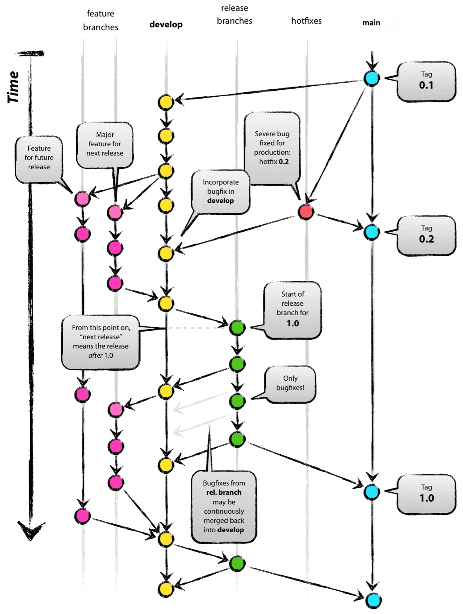

← Previous | [📋 Index](./README.md) | [Next →](./02-branch-structure.md)

---

# Enterprise GitFlow Workflow

## Agenda

1. Branching Model Overview
2. Branch Types & Purposes
3. Developer Workflow
4. Handling Bugs & Fixes
5. Merge Strategy
6. Golden Rules

---

## The Big Picture

---

← Previous | [📋 Index](./README.md) | [Next →](./02-branch-structure.md)
