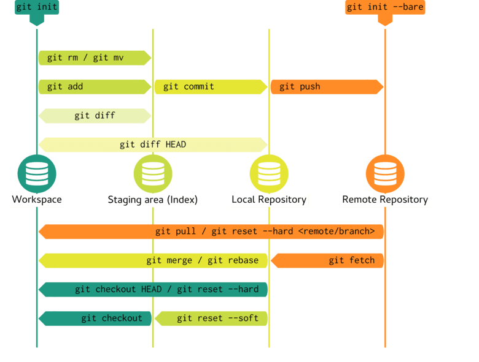

[← Previous](./02-1-commit-basics.md) | [📋 Index](./README.md) | [Next →](./02-3-git-local-remote.md)

---

# Git Workspaces

## The Four Areas of Git

<div style="text-align: center;">

</div>

---

## Understanding Each Area

| Area | Description | Commands |
|------|-------------|----------|
| **Workspace** | Your actual files on disk | `git checkout`, `git restore` |
| **Staging Area (Index)** | Changes marked for next commit | `git add`, `git reset` |
| **Local Repository** | Your commits stored locally | `git commit`, `git log` |
| **Remote Repository** | Shared server (GitLab/GitHub) | `git push`, `git fetch` |

---

## The Flow

```
Edit files → git add → git commit → git push
   │            │           │           │
   ▼            ▼           ▼           ▼
Workspace → Staging → Local Repo → Remote Repo
```

**Going backwards:**
- `git checkout` / `git restore` — discard workspace changes
- `git reset` — unstage from staging area
- `git reset --hard` — reset to a commit (dangerous!)


---

[← Previous](./02-1-commit-basics.md) | [📋 Index](./README.md) | [Next →](./02-3-git-local-remote.md)
