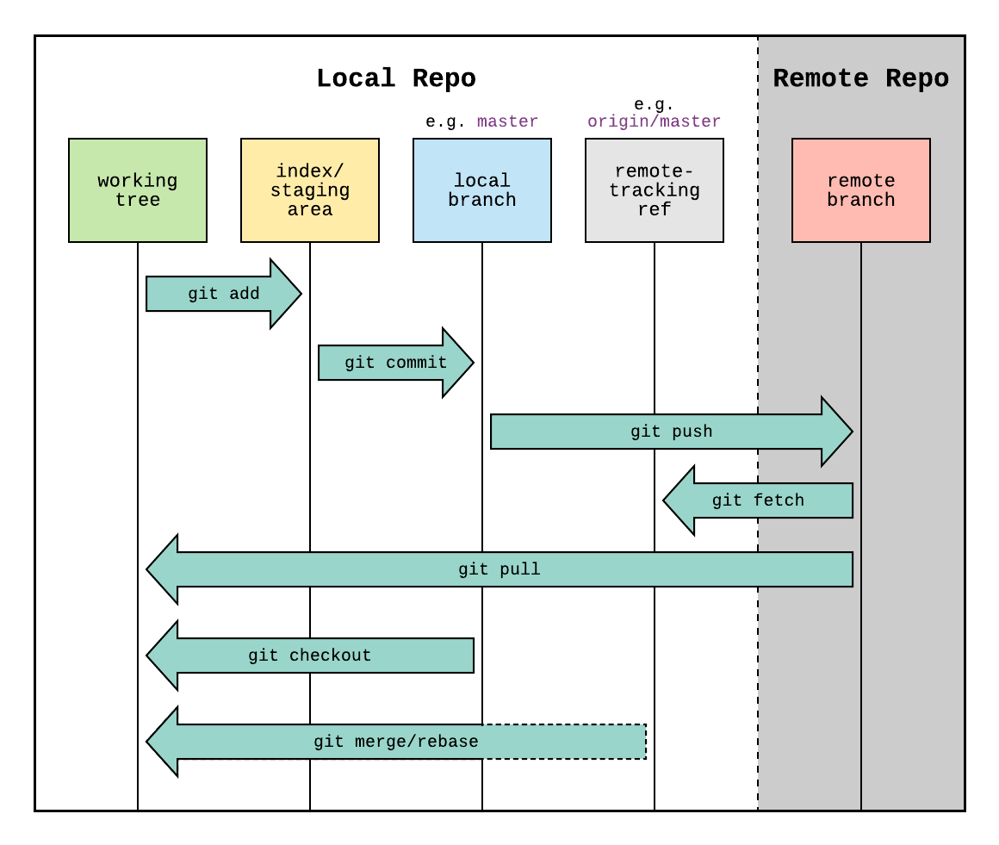

[← Previous](./02-2-git-workspaces.md) | [📋 Index](./README.md) | [Next →](./03-naming-conventions.md)

---

# Local vs Remote Repository

<div style="text-align: center;">

</div>

---

## Key Concepts

| Component | Location | Example |
|-----------|----------|---------|
| **Working Tree** | Your files | Files you edit |
| **Staging Area** | Local | Changes ready to commit |
| **Local Branch** | Local | `main`, `feature/xyz` |
| **Remote-Tracking Ref** | Local | `origin/main`, `origin/dev` |
| **Remote Branch** | Server | Branch on GitLab/GitHub |

---

## Commands Between Local & Remote

| Command | Direction | What it does |
|---------|-----------|--------------|
| `git push` | Local → Remote | Upload your commits |
| `git fetch` | Remote → Local | Download commits (doesn't merge) |
| `git pull` | Remote → Local + Workspace | Fetch + merge into workspace |

---

## Important Distinction

```bash
git fetch origin dev    # Downloads origin/dev, doesn't touch your files
git pull origin dev     # Downloads AND merges into your current branch
```

**Best practice:** Use `fetch` + `rebase` instead of `pull`
```bash
git fetch origin dev
git rebase origin/dev
```


---

[← Previous](./02-2-git-workspaces.md) | [📋 Index](./README.md) | [Next →](./03-naming-conventions.md)
