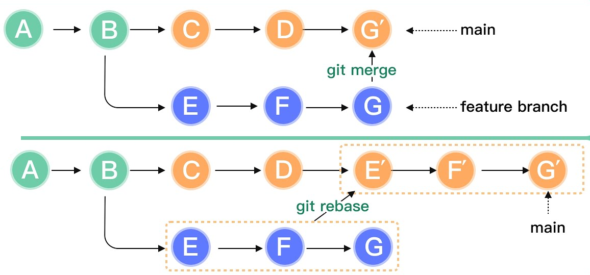

[← Previous](./08-hotfix.md) | [📋 Index](./README.md) | [Next →](./09-2-rebase-danger.md)

---

# Merge Strategy

## Merge Commits

| Path | Strategy |
|------|----------|
| `feature/*` → `dev` | Merge commit |
| `dev` → `stage` | Merge commit |
| `stage` → `main` | Merge commit + tag |

**Why merge commits?**
- Preserves feature history
- Clear audit trail
- Enables `git bisect` (binary search to find bug-introducing commit)

---

## Rebase vs Merge

<div style="text-align: center;">

</div>

---

## When to Use Each

### Rebase: LOCAL only (your feature branch)
```bash
# On YOUR feature branch, to stay current with dev
git rebase origin/dev  ✓
```
- Keeps history linear and clean
- Only safe when **you're the only one** working on the branch

### Merge: SHARED branches
```bash
# On shared parent branch, to integrate sub-branch work
git merge feature/AUTH-100  ✓
```
- Preserves complete history
- Safe for branches **others have pulled**


---

[← Previous](./08-hotfix.md) | [📋 Index](./README.md) | [Next →](./09-2-rebase-danger.md)
