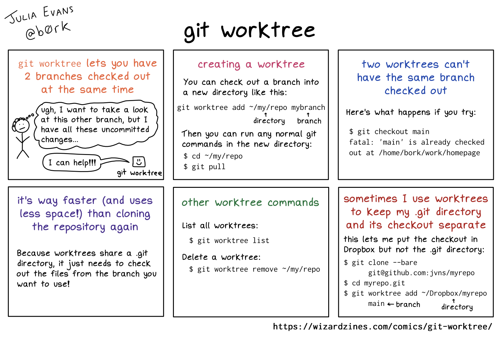
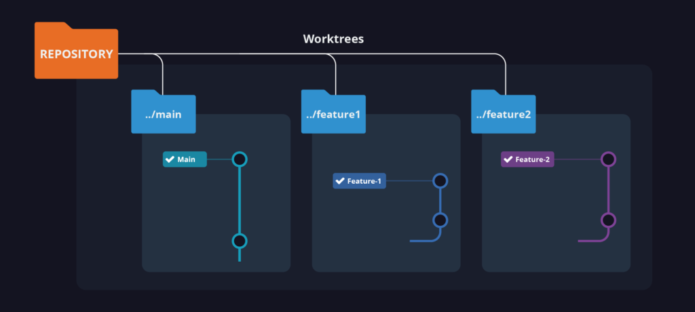

[← Previous](./14-1-security-practices.md) | [📋 Index](./README.md) | [Next →](./15-golden-rules.md)

---

# Performance Best Practices

## Don't Commit These Files!

**Generated/Reproducible files:**
```gitignore
# Dependencies
node_modules/
vendor/
.venv/
__pycache__/

# Build outputs
dist/
build/
*.min.js
*.min.css
*.bundle.js

# IDE & OS
.idea/
.vscode/
.DS_Store
Thumbs.db

# Logs & temp
*.log
*.tmp
*.cache
```

---

## Git LFS for Large Files

**Use Git LFS for binary files > 100KB:**
- Images, videos, audio
- PDFs, Office documents
- Compiled binaries, archives
- Design files (PSD, Sketch, Figma exports)

```bash
# Install & setup
git lfs install

# Track file types
git lfs track "*.psd"
git lfs track "*.zip"
git lfs track "*.mp4"

# Commit .gitattributes
git add .gitattributes
git commit -m "chore: configure Git LFS"
```

---

## Keep Commits Small & Focused

**Good practices:**
- One logical change per commit
- Commit often, push regularly
- Don't mix refactoring with features

**Bad:**
```bash
git commit -m "Add login, fix bugs, refactor utils, update deps"
```

**Good:**
```bash
git commit -m "feat(auth): add login form"
git commit -m "fix(auth): handle empty password"
git commit -m "refactor(utils): extract validation helpers"
```

---

## Repo Hygiene Checklist

| Practice | Why |
|----------|-----|
| Use `.gitignore` | Prevent bloat from generated files |
| Use Git LFS | Large binaries slow down clone/fetch |
| Small commits | Easier review, bisect, revert |
| Delete merged branches | Keep repo clean |
| Prune stale remotes | `git remote prune origin` |
| Regular `git gc` | Optimize local repo |

---

## Advanced: Git Worktree

**Work on multiple branches simultaneously without stashing or cloning:**

<div style="text-align: center;">

</div>

---

### How It Works

<div style="text-align: center;">

</div>

**The mechanism:**
- **One repository, multiple directories** — All worktrees share a single `.git` folder
- **Each worktree = separate folder** — Independent working directory with its own checked-out branch
- **No duplication** — Commits, branches, and history exist only once (in the shared `.git`)
- **Constraint** — A branch can only be checked out in ONE worktree at a time

```
REPOSITORY (.git/)       ← Single source of truth
       │
       ├── ../main/      ← Main worktree (main branch)
       │
       ├── ../feature1/  ← Linked worktree (feature-1 branch)
       │
       └── ../feature2/  ← Linked worktree (feature-2 branch)
```

**On disk, it looks like this:**

```
my-project/              ← Main worktree (has .git/)
├── .git/                ← Shared by ALL worktrees
├── src/
└── ...

my-project-feature1/     ← Linked worktree (points to .git/)
├── .git                 ← File (not folder!) pointing to ../my-project/.git
├── src/
└── ...
```

---

### When to Use

- Reviewing a PR while your feature branch has uncommitted work
- Running tests on one branch while coding on another
- Comparing behavior between branches side-by-side

```bash
# Create a worktree for another branch
git worktree add ../review-branch feature/JIRA-456

# List all worktrees
git worktree list

# Clean up when done
git worktree remove ../review-branch
```

> **Why not just clone again?** Worktrees share the `.git` directory, so they're instant to create and use minimal disk space.

---

## CI/CD Performance Tips

```yaml
# Shallow clone (faster checkout)
variables:
  GIT_DEPTH: 10

# Cache dependencies
cache:
  paths:
    - node_modules/
    - .npm/
```


---

[← Previous](./14-1-security-practices.md) | [📋 Index](./README.md) | [Next →](./15-golden-rules.md)
